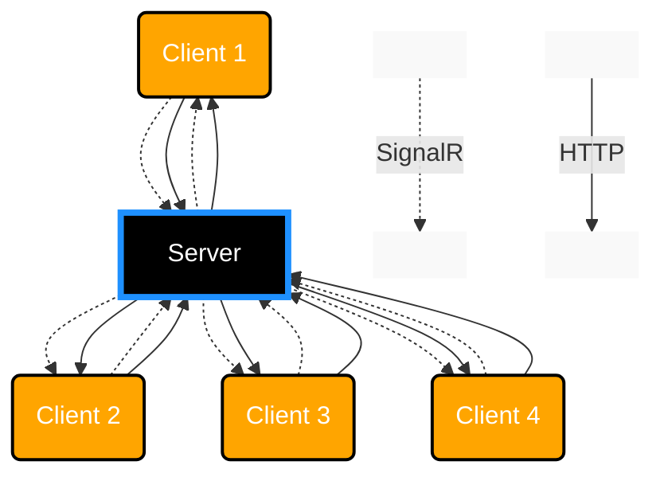

  
  ⇨ [Join us](https://discord.gg/BJ9Swh7HrG)

# Instant Messaging App

Created as a part of Unit-Testing excersises in class.

## Team Members
* Drag-NDrop
* MachineMenace
* GoosLife

# The plan
The multi-step plan is as follows:
| Step | Server                                   | Client          |  Main changes                                                                                |  Progress    | 
|------|------------------------------------------|-----------------|----------------------------------------------------------------------------------------------|--------------|
| 0.5  | Minimal Viable Product in MVC + SignalR  | cshtml View     | Demonstrate a working example of the SignalR protocol in chat-context                        |     ✅      |
| 1    | ASP.Net Core MVC                         | Angular         | Get a MVP up and running for group discussion and decision making                            |     🔵      |
| 2    | Entity Framework, T-SQL                  | Angular         | Enable database support, to save messages, etc. And see if we can make multiple chat rooms   |     🔵      |
| 3    | Direct Message                           | Angular         | Enable 1-1 confidential chats. Ensure nothing is logged or output to server console          |     🔵      |

## Principles
We strive to maintain a set of principles... which we've yet to decide upon 🤔
It could be:
* SOLID
* Parts of SOLID like
  * Single Responsibility  - Pretty relevant in order to do proper unit testing
  * Open/Close
  * Lisskov
  * Interface Segregation
  * Dependency Inversion Principle (DIP)

## Architecture

Intended to be a simple client/server architecture, with minimal fuzz.
We mainly use SignalR and HTTP connections.

# Step 0.5 - The Minimal Viable Product
We use a Razor page to facilitate the chatting over the SignalR connection.

# Step 1

We implement the chat functionality in Angular

## Step 1 - Technology Stack

* ASP.NET Core MVC
* SignalR
* Angular(MS)

## Step 1 - Topology

# Plan for testing 

## Unit tests

| Test Function         | Description                             | 
|-----------------------|-----------------------------------------|
| `SendMessages(str)`   | Tests the sending of messages function. | 
| `CheckProfanity(str)` | Tests for profanity filtering.          | 
| `CheckSecurity(str)`  | Tests the security measures.            | 
| `LogMessage(str)`     | Tests message logging.                  | 
| `OfferXLineState(x)`  | Tests the offering of line states.      | 

## Integration Tests

## Usability Tests

# Suggestions for next steps:

[Link to Step 2](Step2.md)  
[Link to Step 3](Step3.md)
