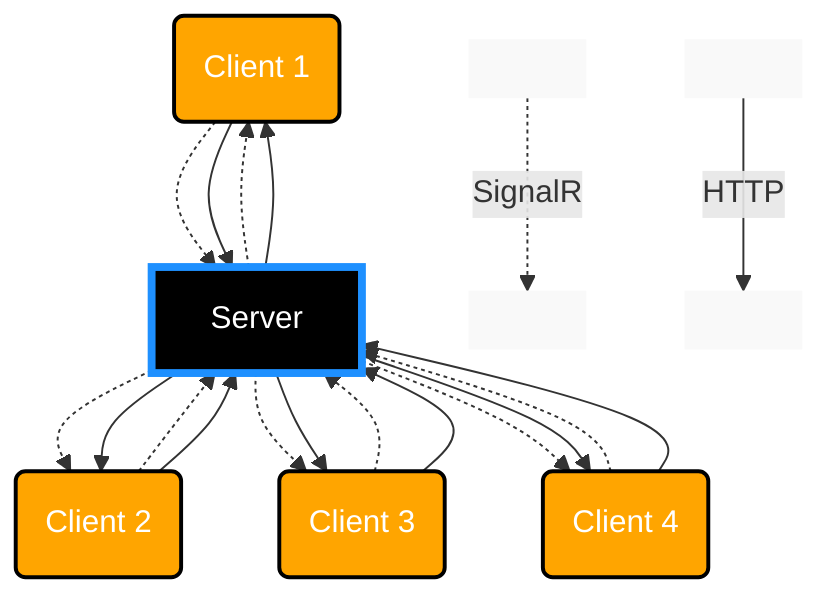

  
  🤝 [Join us](https://discord.gg/BJ9Swh7HrG)

# Instant Messaging App

Created as a part of Unit-Testing excersises in class.

# Table of contents

- [Instant Messaging App](#instant-messaging-app)
- [Table of contents](#table-of-contents)
  - [Team Members](#team-members)
  - [Sub-teams](#sub-teams)
- [Plan for testing](#plan-for-testing)
  - [Testing progress](#testing-progress)
- [The project plan](#the-project-plan)
  - [Approach](#approach)
    - [Principles](#principles)
  - [Architecture](#architecture)
- [Step 1](#step-1)
  - [Step 1 - Technology Stack](#step-1---technology-stack)
  - [Step 1 - Topology](#step-1---topology)
  - [Backend](#backend)
    - [Existing Unit tests - example](#existing-unit-tests---example)
- [Ideas](#ideas)
  - [Suggested tests for the teams](#suggested-tests-for-the-teams)
  - [Constraints](#constraints)
  - [Functionality ideas](#functionality-ideas)
- [Inspiration](#inspiration)
- [Suggestions for next steps:](#suggestions-for-next-steps)

## Team Members
* Drag-NDrop
* MachineMenace
* GoosLife
* Reapz
* Daniel
* Elexthito
* Simon
* PandaOnCaffeine
* Daniel
* Quan

## Sub-teams

|#| Problem area                        | Members                                                      |
|-|-------------------------------------|--------------------------------------------------------------|
|1| FrontEnd - UI                       | Tue, Simon                                                   |
|2| BackEnd - Security features         | Andreas, Frederik                                            |
|3| BackEnd - Profanity-filter features | Anders, Martinus                                             |
|4| BackEnd - SignalR info              | William                                                      |
|5| Integrations                        | Daniel, Martin                                               |
|6| Stakeholder                         | David                                                        |

# Plan for testing 

✅ : Done  
🟡 : In Progress  
🔵 : Planned, but not started  
🔴 : Awaiting plan from team  

| Step         |   Team     | Status  | Area of Responsibility     | Test Definitions                                                                        |  Testing methodology        |
|--------------|------------|:-------:|----------------------------|-----------------------------------------------------------------------------------------|-----------------------------|
| Define Tests |   Team 1   |   🟡    | Front-end                  | - Username is correctly stored in a variable, so it can be passed as a header          |  Unit test                  |
| Define Tests |   Team 1   |   ✅    | Front-end                  | - Frontend can connect to SignalR hub                                                  |  Unit test                  |
| Define Tests |   Team 1   |   🔵    | Front-end                  | - Frontend can send data to SignalR hub                                                |  Unit test                  |
| Define Tests |   Team 1   |   🔵    | Front-end                  | - Frontend kan modtage data fra SignalR hub                                            |  Unit test                  |
| Define Tests |   Team 2   |   🔵    | Back-end Security          | - Sanitize inputs / outputs for > and < (HTML)tags                                     |  Unit test                  |
| Define Tests |   Team 2   |   🔵    | Back-end Security          | - Make sure clients can only send x messages in y time                                 |  Unit test                  |
| Define Tests |   Team 2   |   🔵    | Back-end Security          | - (later, if we get database on) santitize inputs for sql injections                   |  Unit test                  |
| Define Tests |   Team 3   |   🟡    | Back-end Profanity-filter  | - Does the message contain any profanities                                             |  Unit test                  |
| Define Tests |   Team 3   |   🔵    | Back-end Profanity-filter  | - Is the message clean                                                                 |  Unit test                  |
| Define Tests |   Team 3   |   🔵    | Back-end Profanity-filter  | - Is the message empty                                                                 |  Unit test                  |
| Define Tests |   Team 4   |   ✅    | Back-end SignalR Info      | - SignalR get a list of users connected to the hub                                     |  Unit test                  |
| Define Tests |   Team 4   |   ✅    | Back-end SignalR Info      | - SignalR can get a username via the header, upon succesful connection                 |  Unit test                  |
| Define Tests |   Team 4   |   ✅    | Back-end SignalR Info      | - SignalR update internal variables when it detects a client disconnect                |  Unit test                  |
| Define Tests |   Team 4+5 |   ✅    | Backend                    | - Ensure that SignalR functions properly, so FrontEnd team can debug their connection  |  Unit test                  |
| Define Tests |   Team 5   |   🔵    | Integrations               | - Client can discover/ping the Backend-server and establish a successful connection    |  Integration tests          |
| Define Tests |   Team 5   |   ✅    | Backend - SignalR          | - Ensure that bare minimum for SignalR is properly, loaded, along with dependencies    |  Unit test                  |
| Define Tests |   Team 5   |   ✅    | Backend - Rules engine     | - Ensure that bare minimum for a rules engine is properly defined(message-hook draft)  |  Unit test                  |
| Define Tests |   Team 5   |   🔵    | Integrations               | - Server can correctly receive an incoming message and forward it to connected clients |  Integration tests          |
| Define Tests |   Team 5   |   🔵    | Integrations               | - displays appropriate error messages for failed message sending or retrieval          |  Integration tests          |

## Testing progress

| Step         |   Team     | Status  | Area of Responsibility          | Test Definitions                                                                        |  Testing methodology        | Test-function name        |
|--------------|------------|:-------:|---------------------------------|-----------------------------------------------------------------------------------------|-----------------------------|---------------------------|
| Write Tests  |   Team 5   |   ✅    | Back-end ProgramTests.cs        | - Test proper building of Program.cs: Adding SignalR service                            |  Unit test(Fact)            | ShouldAddSignalRService() |
| Write Tests  |   Team 5   |   ✅    | Back-end ProgramTests.cs        | - Test proper building of Program.cs: Ensure there's no problem adding Endpoints        |  Unit test(Fact)            | ShouldUseEndpoints()      |
| Write Tests  |   Team 5   |   ✅    | Back-end ProgramTests.cs        | - Test proper building of Program.cs: Ensure there's no problem setting CORS            |  Unit test(Fact)            | ShouldUseCors()           |
| Write Tests  |   Team 5   |   ✅    | Back-end ProgramTests.cs        | - Test proper building of Program.cs: Ensure there's no problem mapping the SignalR Hub |  Unit test(Fact)            | ShouldMapChatHub()        |
| Write Tests  |   Team 5   |   ✅    | Back-end ProgramTests.cs        | - Test proper building of Program.cs: Ensure there's no problem mapping controllers     |  Unit test(Fact)            | ShouldMapControllers()    |
| Write Tests  |   Team 5   |   ✅    | Back-end ChatHubTests.cs        | - Test proper logging of messages: Ensure there's no problem logging messages           |  Unit test(Moq assertion)   | ShouldLogMessage()        |
| Write Tests  |   Team 5   |   ✅    | Back-end MessageCheckerTests.cs | - Test proper rulechecking on messages: Check outcome in case of profanity              |  Unit test(Theory)          | ShouldCheckMessage()      |
| Write Tests  |   Team 5   |   ✅    | Back-end MessageCheckerTests.cs | - Test proper rulechecking on messages: Check outcome in case of confanity?             |  Unit test(Theory)          | ShouldCheckMessage()      |
| Write Tests  |   Team 5   |   ✅    | Back-end MessageCheckerTests.cs | - Test proper rulechecking on messages: Check outcome in case of security issues        |  Unit test(Theory)          | ShouldCheckMessage()      |
| Write Tests  |   Team 5   |   ✅    | Back-end MessageCheckerTests.cs | - Test proper rulechecking on messages: Check outcome in case of chat command           |  Unit test(Theory)          | ShouldCheckMessage()      |
| Write Tests  |   Team 5   |   ✅    | Back-end MessageCheckerTests.cs | - Test proper rulechecking on messages: Check outcome in case of a valid message        |  Unit test(Theory)          | ShouldCheckMessage()      |

# The project plan
The multi-step plan is as follows:

| Step | Server                                   | Client          |  Main changes                                                                                |  Progress    |  Test-definitions in place |
|:----:|------------------------------------------|:---------------:|----------------------------------------------------------------------------------------------|:------------:|:--------------------------:|
| 0.5  | Minimal Viable Product in MVC + SignalR  | cshtml View     | Demonstrate a working example of the SignalR protocol in chat-context                        | ✅          |             ✅             |
| 1    | ASP.Net Core API                         | Angular         | Get a MVP up and running for group discussion and decision making                            | 🟡          |             🟡             |
| 2    | Entity Framework, T-SQL                  | Angular         | Enable database support, to save messages, etc. And see if we can make multiple chat rooms   | 🔵          |             🔴             |
| 3    | Direct Message                           | Angular         | Enable 1-1 confidential chats. Ensure nothing is logged or output to server console          | 🔵          |             🔴             |

## Approach

Our main focus is Test-driven Development. And this project is mainly being written, in order to practise that.

### Principles
We strive to maintain a set of principles... which we've yet to decide upon 🤔
It could be:
* SOLID
* Parts of SOLID like
  * Single Responsibility  - Pretty relevant in order to do proper unit testing
  * Open/Close
  * Liskov Substitution
  * Interface Segregation
  * Dependency Inversion

## Architecture

Intended to be a simple client/server architecture, with minimal fuzz.
We mainly use SignalR and HTTP connections.

# Step 1

We implement the chat UI functionality in Angular

## Step 1 - Technology Stack

* ASP.NET Core MVC
* SignalR
* Angular(MS)

## Step 1 - Topology

## Backend

### Existing Unit tests - example

| Test Function         | Description                                                                              | 
|-----------------------|------------------------------------------------------------------------------------------|
| `SendMessages(str)`   | Tests the sending of messages function. From the server to the clients, via. SignalR     | 
| `CheckProfanity(str)` | Tests for profanity filtering. Before the server relays messages to the clients          | 
| `CheckSecurity(str)`  | Tests the security measures. Before the server relays messages to the clients            | 
| `LogMessage(str)`     | Tests message logging. Before the server relays messages to the clients                  | 

# Ideas

## Suggested tests for the teams

* Test at en SignalR Hub kan oprettes korrekt
  * Opret SignalR Hub
* Test at en gruppe af hubs kan oprettes korrekt(f.eks. chatrooms)
  * Opret en gruppe af hubs
* Test at en hub kan tage imod beskeder
  * Send beskeder til en hub
* Test at beskeder bliver logget
  * Log beskeder
* Test en besked for profanity
  * Implementer profanity filter før serveren relayer beskeder
 
## Constraints
Limit message sizes
Send x messages in y time

 ## Functionality ideas

| Test Function         | Description                                                                              | 
|-----------------------|------------------------------------------------------------------------------------------|
| `HighlightOwnNameMsgs`| @-mention's support. Highlights messages containing the users own name                   |
| `ChatCommands`        | `/kick, /vote, /motd` and more.. Provides ample opportunity to find more work for us     |

# Inspiration
https://www.codeproject.com/Articles/5162436/Simple-SignalR-Server-and-Client-Applications-Demo

https://code-maze.com/netcore-signalr-angular-realtime-charts/

# Suggestions for next steps:

[Link to Step 2](Step2.md)  
[Link to Step 3](Step3.md)
