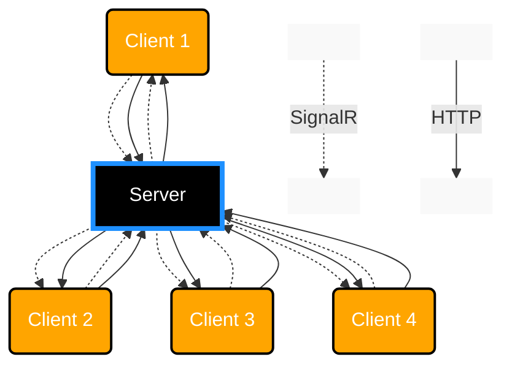

# Instant Messaging App

Created as a part of Unit-Testing excersises in class.

## Team Members
* Drag-NDrop
* MachineMenace
* GoosLife

# The plan
The multi-step plan is as follows:
| Step | Server                  | Client   |  Main changes                                                                               | 
|------|-------------------------|----------|-------------------------------------------------------------------------------------------- |
| 1    | ASP.Net Core MVC        | Angular  | Get a MVP up and running for group discussion and decision making                           |
| 2    | Entity Framework, T-SQL |          | Enable database support, to save messages, etc. And see if we can make multiple chat rooms  |
| 3    | Direct Message          |          | Enable 1-1 confidential chats. Ensure nothing is logged or output to server console         |

# Architecture

Intended to be a simple client/server architecture, with minimal fuzz.
We mainly use SignalR and HTTP connections.

## Step 1 - Technology Stack

* ASP.NET Core MVC
* SignalR

## Step 1 - Topology

# Plan for testing 

## Unit tests

| Test Function         | Description                             | 
|-----------------------|-----------------------------------------|
| `SendMessages(str)`   | Tests the sending of messages function. | 
| `CheckProfanity(str)` | Tests for profanity filtering.          | 
| `CheckSecurity(str)`  | Tests the security measures.            | 
| `LogMessage(str)`     | Tests message logging.                  | 
| `OfferXLineState(x)`  | Tests the offering of line states.      | 

## Integration Tests

## Usability Tests
