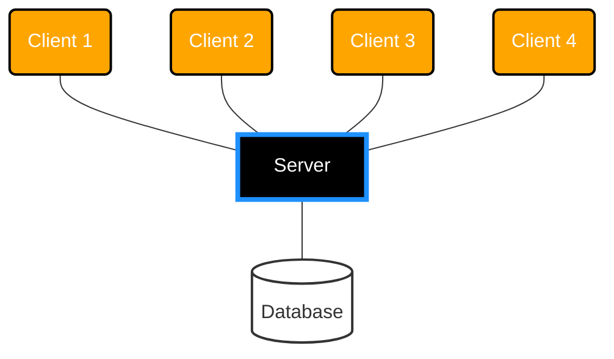

## Step 2 - Technology Stack

* ASP.NET Core MVC
* SignalR
* T-SQL
* Entity Framework

## Step 2 - Topology

```mermaid
graph TD
    client1(Client 1) --- server[Server]
    client2(Client 2) --- server
    client3(Client 3) --- server
    client4(Client 4) --- server
    server --- db[(Database)]

    %% Styling
    classDef client fill:#FFA500,stroke:#000000,stroke-width:2px,color:#FFFFFF;
    classDef server fill:#000000,stroke:#1E90FF,stroke-width:4px,color:#FFFFFF;
    classDef database fill:#FFFFFF,stroke:#333,stroke-width:2px;

    class client1,client2,client3,client4 client;
    class server server;
    class db database;

```
