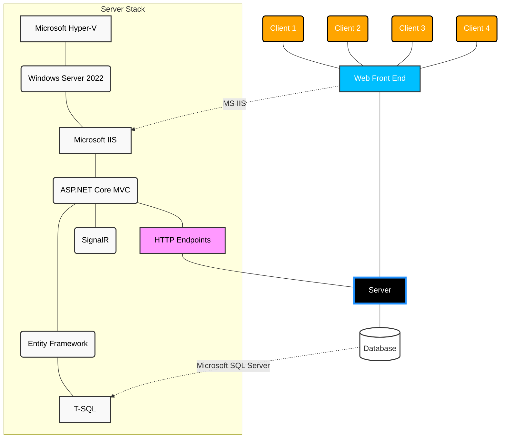

## Step 3 - Technology Stack

* ASP.NET Core MVC
* SignalR
* T-SQL
* Entity Framework
* Microsoft Hyper-V
* Windows Server 2022
* Microsoft IIS

## Step 3 - Topology

```mermaid
graph TD
    client1(Client 1) --- webFE[Web Front End]
    client2(Client 2) --- webFE
    client3(Client 3) --- webFE
    client4(Client 4) --- webFE
    webFE --- server[Server]
    server --- db[(Database)]
    httpEndpoints[HTTP Endpoints] --- server

    subgraph "Server Stack"
    direction TB
        hyperV[Microsoft Hyper-V] --- winServer(Windows Server 2022)
        winServer --- iis[Microsoft IIS]
        iis --- aspNetCore(ASP.NET Core MVC)
        aspNetCore --- httpEndpoints
        aspNetCore --- signalR(SignalR)
        aspNetCore --- efCore(Entity Framework)
        efCore --- tsql[T-SQL]
    end

    db -.->|Microsoft SQL Server| tsql
    webFE -.->|MS IIS| iis
    %% Styling
    classDef client fill:#FFA500,stroke:#000000,stroke-width:2px,color:#FFFFFF;
    classDef server fill:#000000,stroke:#1E90FF,stroke-width:4px,color:#FFFFFF;
    classDef database fill:#FFFFFF,stroke:#333,stroke-width:2px;
    classDef stack fill:#f9f9f9,stroke:#333,stroke-width:2px,color:#000;
    classDef endpoints fill:#f9f,stroke:#333,stroke-width:2px,color:#000;
    classDef webFE fill:#00BFFF,stroke:#333,stroke-width:2px,color:#FFFFFF;

    class client1,client2,client3,client4 client;
    class server server;
    class db database;
    class hyperV,winServer,iis,aspNetCore,signalR,efCore,tsql stack;
    class httpEndpoints endpoints;
    class webFE webFE;


```
